# Production Architecture: GCP Bigtable Observability Platform

> **Document Status**: Updated December 4, 2025 based on architecture review meeting
>
> **Meeting Participants**: Greg, Ian, Matt, Jesse, Broccoli Team, Taxi Team

## Executive Summary

This document describes the production architecture for deploying the Observability Dashboard using Google Cloud Platform (GCP) services, with Google Cloud Bigtable as the primary data store for handling terabytes of observability data (metrics, logs, and alerts).

### Current Status

- **Development**: Dashboard prototype tested locally on on-prem VM in Connecticut with synthetic data
- **Next Phase**: Deploy to GCP non-production environment to capture live, real-world data
- **Approach**: Minimal GCP services for POC, with path to scale for production

### Key Changes from Development Environment

| Component | Development (Current) | POC (GCP Non-Prod) | Production (GCP) |
|-----------|----------------------|-------------------|------------------|
| **Primary Data Store** | PostgreSQL + InfluxDB | Cloud SQL (PostgreSQL) | Google Cloud Bigtable |
| **Data Source** | Mock Data Generator | Real GCP telemetry | Real GCP telemetry |
| **Authentication** | Local credentials | Single GCP Service Account | GCP Service Account + IAM |
| **Caching** | In-Memory | In-Memory (defer Redis) | Cloud Memorystore (Redis) |
| **Real-time Updates** | WebSocket (local) | WebSocket (local) | Cloud Pub/Sub + WebSocket |
| **Deployment** | Local systemd | Compute Engine VM | Compute Engine / MIG / GKE |

> **POC Database Decision (December 4, 2025)**: The POC phase will use **Cloud SQL (PostgreSQL)** instead of Bigtable for cost optimization. PostgreSQL is significantly cheaper for low-volume POC workloads (~$50/month vs ~$500/month for Bigtable minimum). The application will be designed with a database abstraction layer to enable seamless migration to Bigtable for production.

### POC vs Production Scope

| Feature | POC Phase | Production Phase |
|---------|-----------|------------------|
| **Compute** | Single Compute Engine VM | Managed Instance Group (MIG) or GKE |
| **Database** | Cloud SQL (PostgreSQL) | Google Cloud Bigtable |
| **Scaling** | Vertical scaling only | Horizontal Pod Autoscaling |
| **Load Balancer** | None (direct access) | Internal Load Balancer |
| **Caching** | In-memory | Cloud Memorystore (Redis) |
| **Data Pipeline** | Direct API calls | Cloud Dataflow (optional) |
| **DNS** | A-record to private IP | Full DNS + Load Balancer |

### Database Strategy by Environment

| Environment | Database | Rationale | Monthly Cost |
|-------------|----------|-----------|--------------|
| **Development** | Local PostgreSQL | Free, fast iteration | $0 |
| **POC (Non-Prod)** | Cloud SQL (PostgreSQL) | Cost-effective, familiar SQL | ~$50-100 |
| **Non-Production** | Cloud Bigtable (shared) | Test at scale, use "Broc API Test" instance | ~$200-500 |
| **Production** | Cloud Bigtable (dedicated) | Full scale, high availability | ~$2,000+ |

---

## Table of Contents

- [Production Architecture: GCP Bigtable Observability Platform](#production-architecture-gcp-bigtable-observability-platform)
  - [Executive Summary](#executive-summary)
    - [Current Status](#current-status)
    - [Key Changes from Development Environment](#key-changes-from-development-environment)
    - [POC vs Production Scope](#poc-vs-production-scope)
  - [Table of Contents](#table-of-contents)
  - [Why Google Cloud Bigtable?](#why-google-cloud-bigtable)
    - [Advantages for Observability Data](#advantages-for-observability-data)
    - [Comparison: Bigtable vs Current Stack](#comparison-bigtable-vs-current-stack)
    - [Data Volume Expectations](#data-volume-expectations)
  - [Production System Architecture](#production-system-architecture)
    - [POC Architecture (Simplified - Phase 1)](#poc-architecture-simplified---phase-1)
    - [POC Component Responsibilities](#poc-component-responsibilities)
    - [Full Production Architecture (Phase 2)](#full-production-architecture-phase-2)
    - [Production Component Responsibilities](#production-component-responsibilities)
  - [GCP Service Account Configuration](#gcp-service-account-configuration)
    - [Service Account Architecture](#service-account-architecture)
    - [Service Account Setup](#service-account-setup)
    - [Environment Configuration](#environment-configuration)
  - [Bigtable Schema Design](#bigtable-schema-design)
    - [Schema Overview](#schema-overview)
    - [Row Key Design Principles](#row-key-design-principles)
    - [Detailed Schema Definitions](#detailed-schema-definitions)
      - [Metrics Table](#metrics-table)
      - [Logs Table](#logs-table)
      - [Alerts Table](#alerts-table)
    - [Query Patterns](#query-patterns)
  - [Data Ingestion Pipeline](#data-ingestion-pipeline)
    - [Ingestion Architecture](#ingestion-architecture)
    - [Pub/Sub Topic Configuration](#pubsub-topic-configuration)
    - [Dataflow Pipeline Example (Apache Beam / Python)](#dataflow-pipeline-example-apache-beam--python)
  - [Backend Integration](#backend-integration)
    - [Replacing Mock Data with Bigtable Queries](#replacing-mock-data-with-bigtable-queries)
    - [Backend Architecture](#backend-architecture)
    - [Bigtable Client Implementation (TypeScript)](#bigtable-client-implementation-typescript)
    - [tRPC Router Integration](#trpc-router-integration)
  - [Real-time Streaming Architecture](#real-time-streaming-architecture)
    - [WebSocket with Pub/Sub Integration](#websocket-with-pubsub-integration)
    - [Real-time Update Implementation](#real-time-update-implementation)
  - [Security and Access Control](#security-and-access-control)
    - [Security Architecture](#security-architecture)
    - [Security Best Practices](#security-best-practices)
    - [VPC Service Controls Configuration](#vpc-service-controls-configuration)
  - [AI Security & Data Protection](#ai-security--data-protection)
    - [AI Security Architecture](#ai-security-architecture)
    - [AI Security Principles](#ai-security-principles)
    - [PII/PHI Detection Patterns](#piiphi-detection-patterns)
    - [AI System Preprompts](#ai-system-preprompts)
    - [AI Feature Restrictions](#ai-feature-restrictions)
  - [Performance Optimization](#performance-optimization)
    - [Bigtable Performance Best Practices](#bigtable-performance-best-practices)
    - [Pre-Aggregation Strategy](#pre-aggregation-strategy)
    - [Performance Benchmarks](#performance-benchmarks)
    - [Caching Implementation](#caching-implementation)
  - [Cost Considerations](#cost-considerations)
    - [POC Phase Cost Estimate (Minimal Services)](#poc-phase-cost-estimate-minimal-services)
    - [Production Phase Cost Estimate](#production-phase-cost-estimate)
    - [Cost Optimization Strategies](#cost-optimization-strategies)
    - [Data Lifecycle Policy](#data-lifecycle-policy)
  - [Migration Path](#migration-path)
    - [Migration Strategy Overview](#migration-strategy-overview)
    - [Database Abstraction Layer](#database-abstraction-layer)
    - [PostgreSQL to Bigtable Data Migration](#postgresql-to-bigtable-data-migration)
    - [Phase 1: Infrastructure Setup](#phase-1-infrastructure-setup)
    - [Phase 3: Backend Migration with Feature Flag](#phase-3-backend-migration-with-feature-flag)
    - [Phase 4: Shadow Mode Testing](#phase-4-shadow-mode-testing)
    - [Deployment Architecture](#deployment-architecture)
  - [Appendix](#appendix)
    - [A. Required Dependencies](#a-required-dependencies)
    - [B. Terraform Configuration (Alternative to gcloud)](#b-terraform-configuration-alternative-to-gcloud)
    - [C. Quick Reference: Key Row Patterns](#c-quick-reference-key-row-patterns)
  - [Planned AI Features](#planned-ai-features)
    - [1. AI-Powered Firewall Diagnostics](#1-ai-powered-firewall-diagnostics)
    - [2. Subnet Utilization Reporting](#2-subnet-utilization-reporting)
    - [3. Infrastructure Hierarchy Drill-Down](#3-infrastructure-hierarchy-drill-down)
  - [Risks and Open Questions](#risks-and-open-questions)
    - [Identified Risks](#identified-risks)
    - [Open Questions](#open-questions)
    - [Next Steps](#next-steps)

---

## Why Google Cloud Bigtable?

Google Cloud Bigtable is the ideal choice for this observability platform for several key reasons:

> **Note**: ANBC already has 80 Bigtable instances in use. We are investigating reusing the existing "Broc API Test" instance managed by the Broccoli team.
>
> **Bigtable Instance Link**: [broc-api-test-ns-delete](https://console.cloud.google.com/bigtable/instances/broc-api-test-ns-delete/overview?project=anbc-dev-scratch-two)

### Advantages for Observability Data

| Feature | Benefit for Observability |
|---------|--------------------------|
| **Petabyte Scale** | Handles terabytes of metrics, logs, and alerts without performance degradation |
| **Low Latency** | Sub-10ms read latency for dashboard queries |
| **Time-Series Optimized** | Row key design supports efficient time-range queries |
| **High Write Throughput** | 10,000+ writes/second per node for ingesting telemetry |
| **Automatic Sharding** | Distributes data across nodes automatically |
| **Native GCP Integration** | Seamless connection to Cloud Monitoring, Logging, and Dataflow |
| **Replication** | Multi-region replication for disaster recovery |

### Comparison: Bigtable vs Current Stack


### Data Volume Expectations

| Data Type | Daily Volume | Monthly Volume | Retention |
|-----------|-------------|----------------|-----------|
| **Metrics** | ~500 GB | ~15 TB | 90 days |
| **Logs** | ~2 TB | ~60 TB | 30 days |
| **Alerts** | ~10 GB | ~300 GB | 1 year |
| **Traces** | ~200 GB | ~6 TB | 14 days |

---

## Production System Architecture

### POC Architecture (Simplified - Phase 1)

> **Cost Optimization**: For the POC phase, we use minimal GCP services to control operating costs while validating the architecture.


### POC Component Responsibilities

| Component | Responsibility | Notes |
|-----------|---------------|-------|
| **Compute Engine VM** | Single VM hosting all services | Vertical scaling for POC |
| **Cloud Bigtable** | Primary storage for metrics, logs, alerts | Reuse existing "Broc API Test" instance |
| **In-Memory Cache** | Application-level caching | Defer Redis to production |
| **GCP APIs** | Direct API calls for data | No Pub/Sub/Dataflow for POC |
| **DNS A-Record** | Private IP endpoint access | No load balancer for POC |

### Full Production Architecture (Phase 2)

> **Note**: This architecture is for reference when scaling to production. Defer implementation until POC is validated.


### Production Component Responsibilities

| Component | POC Phase | Production Phase |
|-----------|-----------|------------------|
| **Cloud Pub/Sub** | ❌ Not used | Message queue for telemetry ingestion |
| **Cloud Dataflow** | ❌ Not used | ETL processing, batch loading |
| **Cloud Bigtable** | ✅ Reuse existing instance | Primary storage (hot data) |
| **Cloud Storage** | ❌ Not used | Cold storage archive |
| **Memorystore** | ❌ Not used | Redis caching layer |
| **Compute Engine** | ✅ Single VM | Managed Instance Group |
| **Load Balancer** | ❌ Not used | Internal Load Balancer |
| **Cloud CDN** | Frontend static asset delivery |

---

## GCP Service Account Configuration

### Service Account Architecture


### Service Account Setup

```bash
# Create service accounts
gcloud iam service-accounts create observability-api \
    --display-name="Observability Dashboard API" \
    --description="Backend API access to Bigtable and monitoring data"

gcloud iam service-accounts create observability-ingest \
    --display-name="Observability Data Ingestion" \
    --description="Data ingestion pipeline service account"

# Grant roles to API service account
gcloud projects add-iam-policy-binding PROJECT_ID \
    --member="serviceAccount:observability-api@PROJECT_ID.iam.gserviceaccount.com" \
    --role="roles/bigtable.reader"

gcloud projects add-iam-policy-binding PROJECT_ID \
    --member="serviceAccount:observability-api@PROJECT_ID.iam.gserviceaccount.com" \
    --role="roles/monitoring.viewer"

gcloud projects add-iam-policy-binding PROJECT_ID \
    --member="serviceAccount:observability-api@PROJECT_ID.iam.gserviceaccount.com" \
    --role="roles/logging.viewer"

# Grant roles to ingestion service account
gcloud projects add-iam-policy-binding PROJECT_ID \
    --member="serviceAccount:observability-ingest@PROJECT_ID.iam.gserviceaccount.com" \
    --role="roles/bigtable.user"

gcloud projects add-iam-policy-binding PROJECT_ID \
    --member="serviceAccount:observability-ingest@PROJECT_ID.iam.gserviceaccount.com" \
    --role="roles/pubsub.subscriber"

# Download key for local development (use Workload Identity in production)
gcloud iam service-accounts keys create ./keys/observability-api-key.json \
    --iam-account=observability-api@PROJECT_ID.iam.gserviceaccount.com
```

### Environment Configuration

```bash
# .env.production
GCP_PROJECT_ID=your-gcp-project
GCP_REGION=us-central1

# Bigtable Configuration
BIGTABLE_INSTANCE_ID=observability-instance
BIGTABLE_APP_PROFILE=default

# Service Account (for local dev - use Workload Identity in Cloud Run)
GOOGLE_APPLICATION_CREDENTIALS=/path/to/service-account-key.json

# Memorystore Redis
REDIS_HOST=10.0.0.3
REDIS_PORT=6379

# Pub/Sub Topics
PUBSUB_METRICS_TOPIC=observability-metrics
PUBSUB_LOGS_TOPIC=observability-logs
PUBSUB_ALERTS_TOPIC=observability-alerts
```

---

## Bigtable Schema Design

### Schema Overview


### Row Key Design Principles

The row key design is critical for Bigtable performance. Our design follows these principles:

1. **Reverse Timestamp**: Using `Long.MAX_VALUE - timestamp` ensures newest data is read first
2. **Composite Keys**: Combining multiple attributes enables efficient prefix scans
3. **Avoiding Hotspots**: Adding resource/service prefixes distributes writes across nodes

### Detailed Schema Definitions

#### Metrics Table

```
Table: metrics
Row Key Format: {resource_type}#{resource_id}#{metric_name}#{reverse_timestamp}

Example Row Keys:
- gce_instance#instance-123#cpu_utilization#9223372036854775807-1701648000000
- gke_pod#pod-abc#memory_usage#9223372036854775807-1701648000000
- cloud_sql#db-prod#connections#9223372036854775807-1701648000000

Column Families:
┌─────────────────────────────────────────────────────────────────┐
│ Column Family: data                                             │
├─────────────────────────────────────────────────────────────────┤
│ value:double       - The metric value                           │
│ unit:string        - Unit of measurement (%, bytes, ms)         │
│ labels:json        - Additional metric labels                   │
│ aggregation:string - Aggregation type (avg, sum, max, min)      │
└─────────────────────────────────────────────────────────────────┘

┌─────────────────────────────────────────────────────────────────┐
│ Column Family: meta                                             │
├─────────────────────────────────────────────────────────────────┤
│ description:string - Human-readable description                 │
│ metric_kind:string - GAUGE, DELTA, CUMULATIVE                   │
│ value_type:string  - INT64, DOUBLE, BOOL, STRING                │
└─────────────────────────────────────────────────────────────────┘
```

#### Logs Table

```
Table: logs
Row Key Format: {service}#{severity}#{reverse_timestamp}#{uuid}

Example Row Keys:
- api-gateway#ERROR#9223372036854775807-1701648000000#550e8400-e29b
- payment-service#WARNING#9223372036854775807-1701648000000#6ba7b810-9dad
- auth-service#INFO#9223372036854775807-1701648000000#6ba7b811-9dad

Column Families:
┌─────────────────────────────────────────────────────────────────┐
│ Column Family: content                                          │
├─────────────────────────────────────────────────────────────────┤
│ message:string     - Log message content                        │
│ trace_id:string    - Distributed trace ID                       │
│ span_id:string     - Span ID within trace                       │
│ timestamp:long     - Original timestamp (nanoseconds)           │
└─────────────────────────────────────────────────────────────────┘

┌─────────────────────────────────────────────────────────────────┐
│ Column Family: context                                          │
├─────────────────────────────────────────────────────────────────┤
│ labels:json        - Structured labels                          │
│ resource:json      - Resource information (project, zone, etc.) │
│ source:string      - Log source (stdout, file, syslog)          │
│ http_request:json  - HTTP request details (if applicable)       │
└─────────────────────────────────────────────────────────────────┘
```

#### Alerts Table

```
Table: alerts
Row Key Format: {severity}#{status}#{reverse_timestamp}#{alert_id}

Example Row Keys:
- CRITICAL#FIRING#9223372036854775807-1701648000000#alert-001
- WARNING#RESOLVED#9223372036854775807-1701647000000#alert-002
- INFO#ACKNOWLEDGED#9223372036854775807-1701646000000#alert-003

Column Families:
┌─────────────────────────────────────────────────────────────────┐
│ Column Family: alert                                            │
├─────────────────────────────────────────────────────────────────┤
│ name:string        - Alert rule name                            │
│ condition:string   - Alert condition expression                 │
│ threshold:double   - Threshold value                            │
│ metric:string      - Associated metric name                     │
│ resource:json      - Affected resource details                  │
└─────────────────────────────────────────────────────────────────┘

┌─────────────────────────────────────────────────────────────────┐
│ Column Family: state                                            │
├─────────────────────────────────────────────────────────────────┤
│ status:string      - FIRING, ACKNOWLEDGED, RESOLVED             │
│ fired_at:long      - When alert started firing                  │
│ acknowledged_by:string - User who acknowledged                  │
│ acknowledged_at:long   - Acknowledgment timestamp               │
│ resolved_at:long   - Resolution timestamp                       │
│ resolution_note:string - Resolution notes                       │
└─────────────────────────────────────────────────────────────────┘
```

### Query Patterns

```mermaid
flowchart LR
    subgraph Queries["Common Query Patterns"]
        Q1["📊 Dashboard Metrics<br/>Last 1 hour for resource"]
        Q2["📋 Log Search<br/>Errors for service in time range"]
        Q3["🔔 Active Alerts<br/>All firing alerts by severity"]
        Q4["🔍 Trace Lookup<br/>All spans for trace ID"]
    end

    subgraph Scans["Bigtable Scan Operations"]
        S1["Prefix Scan<br/>resource#metric#"]
        S2["Range Scan<br/>service#ERROR#start..end"]
        S3["Prefix Scan<br/>CRITICAL#FIRING#"]
        S4["Prefix Scan<br/>trace_id#"]
    end

    Q1 --> S1
    Q2 --> S2
    Q3 --> S3
    Q4 --> S4
```



---

## Data Ingestion Pipeline

### Ingestion Architecture


### Pub/Sub Topic Configuration

```bash
# Create Pub/Sub topics for each data type
gcloud pubsub topics create metrics-raw --project=PROJECT_ID
gcloud pubsub topics create logs-raw --project=PROJECT_ID
gcloud pubsub topics create alerts-raw --project=PROJECT_ID
gcloud pubsub topics create traces-raw --project=PROJECT_ID

# Create subscriptions for Dataflow jobs
gcloud pubsub subscriptions create metrics-dataflow-sub \
    --topic=metrics-raw \
    --ack-deadline=60 \
    --message-retention-duration=7d

# Configure Cloud Logging sink to Pub/Sub
gcloud logging sinks create observability-logs-sink \
    pubsub.googleapis.com/projects/PROJECT_ID/topics/logs-raw \
    --log-filter='resource.type="gce_instance" OR resource.type="gke_container"'
```

### Dataflow Pipeline Example (Apache Beam / Python)

```python
# dataflow/metrics_processor.py
import apache_beam as beam
from apache_beam.options.pipeline_options import PipelineOptions
from google.cloud import bigtable
from google.cloud.bigtable import row_filters
import json

class ParseMetricMessage(beam.DoFn):
    """Parse Pub/Sub message into metric record."""
    def process(self, element):
        data = json.loads(element.decode('utf-8'))
        yield {
            'resource_type': data.get('resource', {}).get('type'),
            'resource_id': data.get('resource', {}).get('labels', {}).get('instance_id'),
            'metric_name': data.get('metric', {}).get('type'),
            'value': data.get('points', [{}])[0].get('value', {}).get('doubleValue', 0),
            'timestamp': data.get('points', [{}])[0].get('interval', {}).get('endTime'),
            'labels': data.get('metric', {}).get('labels', {})
        }

class GenerateRowKey(beam.DoFn):
    """Generate Bigtable row key from metric data."""
    def process(self, element):
        import time
        # Reverse timestamp for time-descending order
        ts = int(time.time() * 1000)
        reverse_ts = 9223372036854775807 - ts

        row_key = f"{element['resource_type']}#{element['resource_id']}#{element['metric_name']}#{reverse_ts}"
        element['row_key'] = row_key
        yield element

class WriteToBigtable(beam.DoFn):
    """Write records to Bigtable."""
    def __init__(self, project_id, instance_id, table_id):
        self.project_id = project_id
        self.instance_id = instance_id
        self.table_id = table_id
        self.client = None
        self.table = None

    def setup(self):
        self.client = bigtable.Client(project=self.project_id, admin=False)
        instance = self.client.instance(self.instance_id)
        self.table = instance.table(self.table_id)

    def process(self, element):
        row = self.table.direct_row(element['row_key'])

        # Write data column family
        row.set_cell('data', 'value', str(element['value']).encode())
        row.set_cell('data', 'labels', json.dumps(element['labels']).encode())

        row.commit()
        yield element

def run_pipeline():
    options = PipelineOptions([
        '--project=PROJECT_ID',
        '--region=us-central1',
        '--runner=DataflowRunner',
        '--streaming',
        '--job_name=metrics-processor',
        '--temp_location=gs://PROJECT_ID-dataflow-temp/temp'
    ])

    with beam.Pipeline(options=options) as p:
        (p
         | 'Read from Pub/Sub' >> beam.io.ReadFromPubSub(
             subscription='projects/PROJECT_ID/subscriptions/metrics-dataflow-sub')
         | 'Parse Messages' >> beam.ParDo(ParseMetricMessage())
         | 'Generate Row Keys' >> beam.ParDo(GenerateRowKey())
         | 'Write to Bigtable' >> beam.ParDo(
             WriteToBigtable('PROJECT_ID', 'observability-instance', 'metrics'))
        )

if __name__ == '__main__':
    run_pipeline()
```

---

## Backend Integration

### Replacing Mock Data with Bigtable Queries

The existing Express.js backend needs minimal changes to switch from mock data to Bigtable queries.

### Backend Architecture


### Bigtable Client Implementation (TypeScript)

```typescript
// server/services/bigtable-client.ts
import { Bigtable } from '@google-cloud/bigtable';

interface BigtableConfig {
  projectId: string;
  instanceId: string;
}

export class BigtableService {
  private bigtable: Bigtable;
  private instance: any;
  private tables: Map<string, any> = new Map();

  constructor(config: BigtableConfig) {
    this.bigtable = new Bigtable({ projectId: config.projectId });
    this.instance = this.bigtable.instance(config.instanceId);
  }

  private getTable(tableName: string) {
    if (!this.tables.has(tableName)) {
      this.tables.set(tableName, this.instance.table(tableName));
    }
    return this.tables.get(tableName);
  }

  /**
   * Query metrics for a specific resource and time range
   */
  async getMetrics(
    resourceType: string,
    resourceId: string,
    metricName: string,
    startTime: Date,
    endTime: Date,
    limit: number = 1000
  ): Promise<MetricRecord[]> {
    const table = this.getTable('metrics');

    // Calculate reverse timestamps for range scan
    const endReverseTs = 9223372036854775807n - BigInt(startTime.getTime());
    const startReverseTs = 9223372036854775807n - BigInt(endTime.getTime());

    const prefix = `${resourceType}#${resourceId}#${metricName}#`;
    const startRow = `${prefix}${startReverseTs}`;
    const endRow = `${prefix}${endReverseTs}`;

    const [rows] = await table.getRows({
      start: startRow,
      end: endRow,
      limit,
      filter: [
        { family: 'data' },
        { column: { cellLimit: 1 } }
      ]
    });

    return rows.map(this.parseMetricRow);
  }

  /**
   * Query logs with filters
   */
  async getLogs(
    service: string,
    severity: string | null,
    startTime: Date,
    endTime: Date,
    limit: number = 500
  ): Promise<LogRecord[]> {
    const table = this.getTable('logs');

    const endReverseTs = 9223372036854775807n - BigInt(startTime.getTime());
    const startReverseTs = 9223372036854775807n - BigInt(endTime.getTime());

    let prefix = service;
    if (severity) {
      prefix = `${service}#${severity}`;
    }

    const startRow = `${prefix}#${startReverseTs}`;
    const endRow = `${prefix}#${endReverseTs}`;

    const [rows] = await table.getRows({
      start: startRow,
      end: endRow,
      limit,
      filter: [
        { family: 'content' },
        { family: 'context' }
      ]
    });

    return rows.map(this.parseLogRow);
  }

  /**
   * Query active alerts
   */
  async getActiveAlerts(
    severity: string | null = null
  ): Promise<AlertRecord[]> {
    const table = this.getTable('alerts');

    let prefix = '';
    if (severity) {
      prefix = `${severity}#FIRING#`;
    } else {
      // Scan all FIRING alerts across severities
      prefix = '';
    }

    const [rows] = await table.getRows({
      prefix,
      filter: [
        {
          column: {
            family: 'state',
            qualifier: 'status',
            cellLimit: 1
          }
        },
        {
          value: /^FIRING$/
        }
      ]
    });

    return rows.map(this.parseAlertRow);
  }

  private parseMetricRow(row: any): MetricRecord {
    const data = row.data;
    return {
      rowKey: row.id,
      value: parseFloat(data.data?.value?.[0]?.value || '0'),
      unit: data.data?.unit?.[0]?.value || '',
      labels: JSON.parse(data.data?.labels?.[0]?.value || '{}'),
      timestamp: new Date(data.data?.timestamp?.[0]?.value || Date.now())
    };
  }

  private parseLogRow(row: any): LogRecord {
    const content = row.data.content || {};
    const context = row.data.context || {};
    return {
      rowKey: row.id,
      message: content.message?.[0]?.value || '',
      traceId: content.trace_id?.[0]?.value,
      spanId: content.span_id?.[0]?.value,
      labels: JSON.parse(context.labels?.[0]?.value || '{}'),
      resource: JSON.parse(context.resource?.[0]?.value || '{}'),
      source: context.source?.[0]?.value || ''
    };
  }

  private parseAlertRow(row: any): AlertRecord {
    const alert = row.data.alert || {};
    const state = row.data.state || {};
    return {
      rowKey: row.id,
      name: alert.name?.[0]?.value || '',
      condition: alert.condition?.[0]?.value || '',
      threshold: parseFloat(alert.threshold?.[0]?.value || '0'),
      status: state.status?.[0]?.value || '',
      firedAt: new Date(parseInt(state.fired_at?.[0]?.value || '0')),
      acknowledgedBy: state.acknowledged_by?.[0]?.value,
      resolvedAt: state.resolved_at?.[0]?.value
        ? new Date(parseInt(state.resolved_at[0].value))
        : undefined
    };
  }
}

// Type definitions
interface MetricRecord {
  rowKey: string;
  value: number;
  unit: string;
  labels: Record<string, string>;
  timestamp: Date;
}

interface LogRecord {
  rowKey: string;
  message: string;
  traceId?: string;
  spanId?: string;
  labels: Record<string, string>;
  resource: Record<string, string>;
  source: string;
}

interface AlertRecord {
  rowKey: string;
  name: string;
  condition: string;
  threshold: number;
  status: string;
  firedAt: Date;
  acknowledgedBy?: string;
  resolvedAt?: Date;
}
```

### tRPC Router Integration

```typescript
// server/routes/metrics.ts
import { router, publicProcedure } from '../trpc';
import { z } from 'zod';
import { BigtableService } from '../services/bigtable-client';
import { CacheManager } from '../services/cache-manager';

const bigtable = new BigtableService({
  projectId: process.env.GCP_PROJECT_ID!,
  instanceId: process.env.BIGTABLE_INSTANCE_ID!
});

const cache = new CacheManager({
  host: process.env.REDIS_HOST!,
  port: parseInt(process.env.REDIS_PORT!)
});

export const metricsRouter = router({
  getMetrics: publicProcedure
    .input(z.object({
      resourceType: z.string(),
      resourceId: z.string(),
      metricName: z.string(),
      startTime: z.string().datetime(),
      endTime: z.string().datetime(),
      limit: z.number().optional().default(1000)
    }))
    .query(async ({ input }) => {
      const cacheKey = `metrics:${input.resourceType}:${input.resourceId}:${input.metricName}`;

      // Try cache first (for dashboard data that doesn't need to be real-time)
      const cached = await cache.get(cacheKey);
      if (cached) {
        return JSON.parse(cached);
      }

      const metrics = await bigtable.getMetrics(
        input.resourceType,
        input.resourceId,
        input.metricName,
        new Date(input.startTime),
        new Date(input.endTime),
        input.limit
      );

      // Cache for 30 seconds
      await cache.set(cacheKey, JSON.stringify(metrics), 30);

      return metrics;
    }),

  getAggregatedMetrics: publicProcedure
    .input(z.object({
      resourceType: z.string(),
      metricName: z.string(),
      aggregation: z.enum(['avg', 'sum', 'max', 'min']),
      interval: z.enum(['1m', '5m', '1h', '1d']),
      startTime: z.string().datetime(),
      endTime: z.string().datetime()
    }))
    .query(async ({ input }) => {
      // For aggregated metrics, we'd use a separate pre-aggregated table
      // or compute aggregations on-the-fly for smaller datasets
      const metrics = await bigtable.getMetrics(
        input.resourceType,
        '*', // All resources of this type
        input.metricName,
        new Date(input.startTime),
        new Date(input.endTime),
        10000
      );

      // Perform aggregation
      return aggregateMetrics(metrics, input.aggregation, input.interval);
    })
});

function aggregateMetrics(
  metrics: MetricRecord[],
  aggregation: string,
  interval: string
): AggregatedMetric[] {
  // Group by interval and apply aggregation function
  // Implementation details...
}
```

---

## Real-time Streaming Architecture

### WebSocket with Pub/Sub Integration


### Real-time Update Implementation

```typescript
// server/services/realtime-manager.ts
import { PubSub, Subscription } from '@google-cloud/pubsub';
import { WebSocketServer, WebSocket } from 'ws';

interface RealtimeConfig {
  projectId: string;
  subscriptionName: string;
}

export class RealtimeManager {
  private pubsub: PubSub;
  private subscription: Subscription;
  private clients: Map<string, Set<WebSocket>> = new Map();
  private wss: WebSocketServer;

  constructor(config: RealtimeConfig, wss: WebSocketServer) {
    this.pubsub = new PubSub({ projectId: config.projectId });
    this.subscription = this.pubsub.subscription(config.subscriptionName);
    this.wss = wss;

    this.initializePubSubListener();
    this.initializeWebSocketHandlers();
  }

  private initializePubSubListener() {
    this.subscription.on('message', (message) => {
      const data = JSON.parse(message.data.toString());
      const channel = data.channel; // e.g., 'metrics', 'alerts', 'logs'

      this.broadcast(channel, data);
      message.ack();
    });

    this.subscription.on('error', (error) => {
      console.error('Pub/Sub error:', error);
    });
  }

  private initializeWebSocketHandlers() {
    this.wss.on('connection', (ws: WebSocket, req) => {
      const clientId = this.generateClientId();

      ws.on('message', (message) => {
        const { action, channel } = JSON.parse(message.toString());

        if (action === 'subscribe') {
          this.subscribe(clientId, channel, ws);
        } else if (action === 'unsubscribe') {
          this.unsubscribe(clientId, channel);
        }
      });

      ws.on('close', () => {
        this.removeClient(clientId);
      });
    });
  }

  private subscribe(clientId: string, channel: string, ws: WebSocket) {
    if (!this.clients.has(channel)) {
      this.clients.set(channel, new Set());
    }
    this.clients.get(channel)!.add(ws);
  }

  private broadcast(channel: string, data: any) {
    const subscribers = this.clients.get(channel);
    if (subscribers) {
      const message = JSON.stringify(data);
      subscribers.forEach((ws) => {
        if (ws.readyState === WebSocket.OPEN) {
          ws.send(message);
        }
      });
    }
  }

  private generateClientId(): string {
    return `client_${Date.now()}_${Math.random().toString(36).substr(2, 9)}`;
  }

  private unsubscribe(clientId: string, channel: string) {
    // Implementation
  }

  private removeClient(clientId: string) {
    // Clean up client from all channels
  }
}
```

---

## Security and Access Control

### Security Architecture


### Security Best Practices

| Layer | Implementation |
|-------|---------------|
| **Network** | VPC Service Controls, Private Google Access |
| **Authentication** | Identity-Aware Proxy for web, OAuth for API |
| **Authorization** | Cloud IAM + Application-level RBAC |
| **Data Encryption** | Encryption at rest (default), TLS 1.3 in transit |
| **Audit Logging** | Cloud Audit Logs for all data access |
| **Secret Management** | Secret Manager for credentials |

### VPC Service Controls Configuration

```bash
# Create a service perimeter for observability resources
gcloud access-context-manager perimeters create observability-perimeter \
    --title="Observability Platform Perimeter" \
    --resources="projects/PROJECT_NUMBER" \
    --restricted-services="bigtable.googleapis.com,pubsub.googleapis.com" \
    --access-levels="accessPolicies/POLICY_ID/accessLevels/corp-network"

# Enable VPC-SC for Bigtable
gcloud services vpc-peerings connect \
    --service=servicenetworking.googleapis.com \
    --ranges=observability-range \
    --network=observability-vpc
```

---

## AI Security & Data Protection

> **Critical Security Requirement**: All AI features in the Observability Dashboard must adhere to strict security and privacy guidelines to protect sensitive infrastructure data and comply with HIPAA requirements.

### AI Security Architecture

```mermaid
flowchart TB
    subgraph UserInput["User Input Layer"]
        UI["Dashboard UI"]
        Chat["AI Chat Interface"]
        Form["Analysis Form"]
    end

    subgraph ClientFilter["Client-Side Filtering"]
        PII1["PII Detection<br/>(SSN, Credit Cards)"]
        PHI["PHI Detection<br/>(Patient IDs, MRN)"]
        Contact["Contact Info<br/>(Phone, Email)"]
        Redact1["Redaction Engine"]
    end

    subgraph ServerFilter["Server-Side Filtering"]
        Validate["Input Validation"]
        PII2["Secondary PII Scan"]
        Sanitize["Data Sanitization"]
        Redact2["Server Redaction"]
    end

    subgraph AILayer["AI Processing Layer"]
        Preprompt["System Preprompts<br/>(Security Directives)"]
        Context["Context Injection<br/>(Mock/Sample Data Only)"]
        LLM["AI Model<br/>(No Internet Access)"]
    end

    subgraph Restrictions["Security Restrictions"]
        NoInternet["❌ No External Internet"]
        NoCredentials["❌ No Service Account Access"]
        NoRawData["❌ No Raw PII/PHI"]
        AuditLog["✅ Full Audit Logging"]
    end

    UI --> PII1
    Chat --> PII1
    Form --> PII1

    PII1 --> PHI
    PHI --> Contact
    Contact --> Redact1

    Redact1 --> Validate
    Validate --> PII2
    PII2 --> Sanitize
    Sanitize --> Redact2

    Redact2 --> Preprompt
    Preprompt --> Context
    Context --> LLM

    LLM -.-> NoInternet
    LLM -.-> NoCredentials
    LLM -.-> NoRawData
    LLM --> AuditLog
```



### AI Security Principles

| Principle | Implementation | Enforcement |
|-----------|---------------|-------------|
| **No Internet Access** | AI features cannot make external API calls | Network policy + code review |
| **No Credential Exposure** | AI never accesses service account keys or secrets | IAM separation + audit logs |
| **PII/PHI Filtering** | Multi-layer detection and redaction | Client + Server filtering |
| **Audit Trail** | All AI interactions logged | Cloud Audit Logs |
| **Data Minimization** | AI only sees sanitized, mock, or aggregated data | Data pipeline design |

### PII/PHI Detection Patterns

The following patterns are detected and automatically redacted at both client and server layers:

| Data Type | Pattern | Example | Redacted As |
|-----------|---------|---------|-------------|
| **SSN** | `\d{3}[-.\s]?\d{2}[-.\s]?\d{4}` | 123-45-6789 | [SSN REDACTED] |
| **Credit Card** | `(?:\d{4}[-.\s]?){3}\d{4}` | 4111-1111-1111-1111 | [CARD REDACTED] |
| **Patient ID** | `(?:MRN\|PATIENT[_-]?ID)[:\s]*[A-Z0-9-]+` | MRN: ABC123456 | [PATIENT_ID REDACTED] |
| **Phone Number** | `(?:\+1[-.\s]?)?\(?\d{3}\)?[-.\s]?\d{3}[-.\s]?\d{4}` | (555) 123-4567 | [PHONE REDACTED] |
| **Email** | `[A-Za-z0-9._%+-]+@[A-Za-z0-9.-]+\.[A-Za-z]{2,}` | user@example.com | [EMAIL REDACTED] |

### AI System Preprompts

All AI features include mandatory security preprompts that are injected before any user query:

```typescript
const AI_SYSTEM_PREPROMPTS = [
  "SECURITY DIRECTIVE: Never make external internet requests or API calls outside the organization.",
  "SECURITY DIRECTIVE: Never access, request, or expose service account credentials or API keys.",
  "SECURITY DIRECTIVE: Automatically redact any PII (SSN, credit cards, patient IDs, phone numbers) from all responses.",
  "SECURITY DIRECTIVE: Only use information provided in the user query and the platform's mock/sample data.",
  "CONTEXT: You are an AI firewall diagnostics assistant for the GCP Observability Dashboard.",
];
```

### AI Feature Restrictions

```mermaid
flowchart LR
    subgraph Allowed["✅ Allowed Operations"]
        A1["Analyze firewall rules"]
        A2["Suggest configurations"]
        A3["Explain network paths"]
        A4["Generate gcloud commands"]
        A5["Use mock/sample data"]
    end

    subgraph Blocked["❌ Blocked Operations"]
        B1["External API calls"]
        B2["Access GCP credentials"]
        B3["Query production data directly"]
        B4["Store conversation history"]
        B5["Access user PII/PHI"]
    end
```



---

## Performance Optimization

### Bigtable Performance Best Practices


### Pre-Aggregation Strategy

For common dashboard queries, we use pre-aggregated tables to reduce query latency:

```
Table: metrics_aggregated
Row Key Format: {aggregation_interval}#{resource_type}#{metric_name}#{reverse_timestamp}

Aggregation Intervals:
- 1m (1 minute) - for last hour views
- 5m (5 minutes) - for last 6 hours
- 1h (1 hour) - for last 7 days
- 1d (1 day) - for last 90 days

Column Families:
┌─────────────────────────────────────────────────────────────────┐
│ Column Family: agg                                              │
├─────────────────────────────────────────────────────────────────┤
│ min:double       - Minimum value in interval                    │
│ max:double       - Maximum value in interval                    │
│ avg:double       - Average value in interval                    │
│ sum:double       - Sum of values in interval                    │
│ count:long       - Number of data points                        │
│ p50:double       - 50th percentile                              │
│ p95:double       - 95th percentile                              │
│ p99:double       - 99th percentile                              │
└─────────────────────────────────────────────────────────────────┘
```

### Performance Benchmarks

| Query Type | Expected Latency | Rows Scanned | Caching |
|------------|-----------------|--------------|---------|
| Dashboard load (1h metrics) | <50ms | ~3,600 | Cached 30s |
| Log search (1h, filtered) | <200ms | ~10,000 | No cache |
| Alert list (active) | <20ms | ~100 | Cached 5s |
| Trace lookup (single) | <10ms | ~50 | No cache |
| Historical metrics (7d) | <500ms | ~10,000 | Cached 5min |

### Caching Implementation

```typescript
// server/services/cache-manager.ts
import Redis from 'ioredis';

interface CacheConfig {
  host: string;
  port: number;
  keyPrefix?: string;
}

export class CacheManager {
  private redis: Redis;
  private keyPrefix: string;

  constructor(config: CacheConfig) {
    this.redis = new Redis({
      host: config.host,
      port: config.port,
      retryDelayOnFailover: 100,
      maxRetriesPerRequest: 3
    });
    this.keyPrefix = config.keyPrefix || 'obs:';
  }

  async get(key: string): Promise<string | null> {
    return this.redis.get(this.keyPrefix + key);
  }

  async set(key: string, value: string, ttlSeconds: number): Promise<void> {
    await this.redis.setex(this.keyPrefix + key, ttlSeconds, value);
  }

  async invalidatePattern(pattern: string): Promise<void> {
    const keys = await this.redis.keys(this.keyPrefix + pattern);
    if (keys.length > 0) {
      await this.redis.del(...keys);
    }
  }

  // Cache-aside pattern for dashboard data
  async getOrFetch<T>(
    key: string,
    ttlSeconds: number,
    fetchFn: () => Promise<T>
  ): Promise<T> {
    const cached = await this.get(key);
    if (cached) {
      return JSON.parse(cached);
    }

    const data = await fetchFn();
    await this.set(key, JSON.stringify(data), ttlSeconds);
    return data;
  }
}
```

---

## Cost Considerations

### POC Phase Cost Estimate (Minimal Services)

> **Updated December 4, 2025**: POC will use Cloud SQL (PostgreSQL) instead of Bigtable for significant cost savings.

| Component | Configuration | Monthly Cost (USD) |
|-----------|--------------|-------------------|
| **Compute Engine VM** | n2-standard-4 (4 vCPU, 16 GB RAM) | ~$150 |
| **Cloud SQL (PostgreSQL)** | db-f1-micro (shared core, 10 GB) | ~$50 |
| **Cloud Logging** | Basic logging (included) | ~$0 |
| **Networking** | Internal traffic only | ~$50 |
| **Total POC** | | **~$250/month** |

> **Cost Comparison**: Using PostgreSQL for POC saves ~$450/month compared to a dedicated Bigtable instance. The application uses a database abstraction layer to enable seamless migration to Bigtable for production.

#### POC Database: Cloud SQL (PostgreSQL) Configuration

```bash
# Create Cloud SQL PostgreSQL instance for POC
gcloud sql instances create observability-poc-db \
    --database-version=POSTGRES_15 \
    --tier=db-f1-micro \
    --region=us-central1 \
    --storage-size=10GB \
    --storage-type=SSD \
    --availability-type=zonal \
    --network=observability-vpc

# Create database
gcloud sql databases create observability \
    --instance=observability-poc-db

# Create user
gcloud sql users create observability-app \
    --instance=observability-poc-db \
    --password=SECURE_PASSWORD
```

### Production Phase Cost Estimate

Based on the data volumes specified earlier (~80 TB/month across all data types):

| Component | Configuration | Monthly Cost (USD) |
|-----------|--------------|-------------------|
| **Compute Engine MIG** | 3x n2-standard-4, autoscaling | ~$450 |
| **Bigtable Instance** | 6 nodes (SSD), us-central1 | ~$4,200 |
| **Bigtable Storage** | 80 TB (after compression ~40 TB) | ~$6,400 |
| **Cloud Dataflow** | 4 streaming jobs, 2 workers each | ~$1,800 |
| **Cloud Pub/Sub** | 10 TB messages/month | ~$400 |
| **Memorystore** | 5 GB Redis, HA | ~$200 |
| **Internal Load Balancer** | Standard tier | ~$50 |
| **Cloud Storage** | Cold archive, 100 TB | ~$2,300 |
| **Networking** | Egress, internal | ~$500 |
| **Total Production** | | **~$16,300/month** |

### Cost Optimization Strategies

```mermaid
flowchart LR
    subgraph Strategies["Cost Optimization"]
        S1["📉 Data Lifecycle<br/>Auto-delete old data"]
        S2["🗜️ Compression<br/>Reduce storage 50-70%"]
        S3["📊 Downsampling<br/>Aggregate older metrics"]
        S4["❄️ Cold Storage<br/>Archive to GCS"]
        S5["⚖️ Right-sizing<br/>Monitor utilization"]
    end

    subgraph Savings["Potential Savings"]
        SA["30% storage reduction"]
        SB["40% compute optimization"]
        SC["60% archive savings"]
    end

    S1 --> SA
    S2 --> SA
    S3 --> SA
    S4 --> SC
    S5 --> SB
```



### Data Lifecycle Policy

```bash
# Bigtable garbage collection policy (auto-delete old data)
cbt setgcpolicy observability-instance metrics \
    data maxage=90d

cbt setgcpolicy observability-instance logs \
    content maxage=30d

cbt setgcpolicy observability-instance traces \
    span maxage=14d

# Schedule cold storage archival (Cloud Composer DAG)
# Archive data older than retention period to Cloud Storage
```

---

## Migration Path

### Migration Strategy Overview

> **Updated December 4, 2025**: Migration path now includes PostgreSQL → Bigtable transition between POC and Production phases.


### Database Abstraction Layer

To enable seamless migration from PostgreSQL (POC) to Bigtable (Production), the application uses a database abstraction layer:

```typescript
// server/db/DatabaseAdapter.ts
interface DatabaseAdapter {
  // Metrics
  getMetrics(resourceType: string, timeRange: TimeRange): Promise<Metric[]>;
  writeMetrics(metrics: Metric[]): Promise<void>;

  // Logs
  getLogs(filter: LogFilter): Promise<Log[]>;
  writeLogs(logs: Log[]): Promise<void>;

  // Alerts
  getAlerts(status?: AlertStatus): Promise<Alert[]>;
  writeAlert(alert: Alert): Promise<void>;
}

// PostgreSQL implementation (POC)
class PostgreSQLAdapter implements DatabaseAdapter { ... }

// Bigtable implementation (Production)
class BigtableAdapter implements DatabaseAdapter { ... }

// Factory function
function createDatabaseAdapter(): DatabaseAdapter {
  if (process.env.DATABASE_TYPE === 'bigtable') {
    return new BigtableAdapter();
  }
  return new PostgreSQLAdapter();
}
```

### PostgreSQL to Bigtable Data Migration

```bash
#!/bin/bash
# scripts/migrate-postgres-to-bigtable.sh

# Export data from PostgreSQL
pg_dump -h $POSTGRES_HOST -U $POSTGRES_USER -d observability \
    --format=csv --table=metrics > /tmp/metrics.csv

# Transform and load to Bigtable using Dataflow
gcloud dataflow jobs run postgres-to-bigtable-migration \
    --gcs-location=gs://dataflow-templates/latest/GCS_Text_to_Cloud_Bigtable \
    --parameters \
        inputFilePattern=gs://observability-migration/metrics.csv,\
        bigtableProjectId=$PROJECT_ID,\
        bigtableInstanceId=observability-prod,\
        bigtableTableId=metrics
```

### Phase 1: Infrastructure Setup

```bash
#!/bin/bash
# scripts/setup-gcp-infrastructure.sh

PROJECT_ID="observability-prod"
REGION="us-central1"

# Create project and enable APIs
gcloud projects create $PROJECT_ID --name="Observability Platform"
gcloud config set project $PROJECT_ID

gcloud services enable \
    bigtable.googleapis.com \
    bigtableadmin.googleapis.com \
    pubsub.googleapis.com \
    dataflow.googleapis.com \
    run.googleapis.com \
    redis.googleapis.com \
    secretmanager.googleapis.com

# Create VPC network
gcloud compute networks create observability-vpc \
    --subnet-mode=custom

gcloud compute networks subnets create observability-subnet \
    --network=observability-vpc \
    --region=$REGION \
    --range=10.0.0.0/20

# Create Bigtable instance
gcloud bigtable instances create observability-instance \
    --display-name="Observability Platform" \
    --cluster-config=id=observability-cluster-1,zone=$REGION-a,nodes=3,storage-type=SSD \
    --cluster-config=id=observability-cluster-2,zone=$REGION-b,nodes=3,storage-type=SSD

# Create tables
cbt -instance=observability-instance createtable metrics
cbt -instance=observability-instance createfamily metrics data
cbt -instance=observability-instance createfamily metrics meta

cbt -instance=observability-instance createtable logs
cbt -instance=observability-instance createfamily logs content
cbt -instance=observability-instance createfamily logs context

cbt -instance=observability-instance createtable alerts
cbt -instance=observability-instance createfamily alerts alert
cbt -instance=observability-instance createfamily alerts state

cbt -instance=observability-instance createtable traces
cbt -instance=observability-instance createfamily traces span
cbt -instance=observability-instance createfamily traces attrs

echo "Infrastructure setup complete!"
```

### Phase 3: Backend Migration with Feature Flag

```typescript
// server/config/feature-flags.ts
export const featureFlags = {
  useBigtable: process.env.USE_BIGTABLE === 'true',
  bigtablePercentage: parseInt(process.env.BIGTABLE_ROLLOUT_PERCENTAGE || '0'),
};

// server/services/data-source-factory.ts
import { MockDataSource } from './mock-data-source';
import { BigtableDataSource } from './bigtable-data-source';
import { featureFlags } from '../config/feature-flags';

export interface DataSource {
  getMetrics(params: MetricQuery): Promise<MetricRecord[]>;
  getLogs(params: LogQuery): Promise<LogRecord[]>;
  getAlerts(params: AlertQuery): Promise<AlertRecord[]>;
}

export function getDataSource(userId: string): DataSource {
  if (!featureFlags.useBigtable) {
    return new MockDataSource();
  }

  // Gradual rollout based on user ID hash
  const hash = hashUserId(userId);
  const percentage = hash % 100;

  if (percentage < featureFlags.bigtablePercentage) {
    return new BigtableDataSource();
  }

  return new MockDataSource();
}

function hashUserId(userId: string): number {
  let hash = 0;
  for (let i = 0; i < userId.length; i++) {
    const char = userId.charCodeAt(i);
    hash = ((hash << 5) - hash) + char;
    hash = hash & hash; // Convert to 32bit integer
  }
  return Math.abs(hash);
}
```

### Phase 4: Shadow Mode Testing

```typescript
// server/middleware/shadow-mode.ts
import { DataSource } from '../services/data-source-factory';
import { MockDataSource } from '../services/mock-data-source';
import { BigtableDataSource } from '../services/bigtable-data-source';

export async function shadowModeQuery<T>(
  queryFn: (ds: DataSource) => Promise<T>,
  compareResults: boolean = true
): Promise<T> {
  const mockSource = new MockDataSource();
  const bigtableSource = new BigtableDataSource();

  // Always return mock data, but also query Bigtable for comparison
  const [mockResult, bigtableResult] = await Promise.allSettled([
    queryFn(mockSource),
    queryFn(bigtableSource)
  ]);

  if (compareResults && mockResult.status === 'fulfilled' && bigtableResult.status === 'fulfilled') {
    // Log differences for analysis
    const mockCount = Array.isArray(mockResult.value) ? mockResult.value.length : 1;
    const btCount = Array.isArray(bigtableResult.value) ? bigtableResult.value.length : 1;

    if (mockCount !== btCount) {
      console.log(`[Shadow Mode] Result count mismatch: Mock=${mockCount}, Bigtable=${btCount}`);
    }
  }

  if (bigtableResult.status === 'rejected') {
    console.error('[Shadow Mode] Bigtable query failed:', bigtableResult.reason);
  }

  if (mockResult.status === 'rejected') {
    throw mockResult.reason;
  }

  return mockResult.value;
}
```

### Deployment Architecture


---

## Appendix

### A. Required Dependencies

```json
{
  "dependencies": {
    "@google-cloud/bigtable": "^5.0.0",
    "@google-cloud/pubsub": "^4.0.0",
    "ioredis": "^5.3.0"
  },
  "devDependencies": {
    "@types/google-cloud__bigtable": "^2.0.0"
  }
}
```

### B. Terraform Configuration (Alternative to gcloud)

```hcl
# terraform/bigtable.tf
resource "google_bigtable_instance" "observability" {
  name                = "observability-instance"
  deletion_protection = true

  cluster {
    cluster_id   = "observability-cluster-1"
    zone         = "us-central1-a"
    num_nodes    = 3
    storage_type = "SSD"
  }

  cluster {
    cluster_id   = "observability-cluster-2"
    zone         = "us-central1-b"
    num_nodes    = 3
    storage_type = "SSD"
  }
}

resource "google_bigtable_table" "metrics" {
  name          = "metrics"
  instance_name = google_bigtable_instance.observability.name

  column_family {
    family = "data"
  }

  column_family {
    family = "meta"
  }
}

resource "google_bigtable_gc_policy" "metrics_data" {
  instance_name = google_bigtable_instance.observability.name
  table         = google_bigtable_table.metrics.name
  column_family = "data"

  max_age {
    duration = "7776000s" # 90 days
  }
}
```

### C. Quick Reference: Key Row Patterns

| Use Case | Row Key Pattern | Example |
|----------|-----------------|---------|
| Latest metrics for resource | `{type}#{id}#{metric}#0...` | `gce#i-123#cpu#0` |
| Metrics in time range | `{type}#{id}#{metric}#{start}..{end}` | Prefix + range scan |
| Errors for service | `{service}#ERROR#` | `api-gateway#ERROR#` |
| All alerts (newest first) | `CRITICAL#FIRING#` | Prefix scan |
| Single trace | `{trace_id}#` | `abc123#` |

---

## Planned AI Features

The following AI-powered features are planned for implementation based on meeting feedback:

### 1. AI-Powered Firewall Diagnostics

Users can input source and destination IPs to receive AI-generated diagnostics on potential connectivity issues without manually inspecting logs.


**Use Cases:**
- Diagnose blocked traffic between VMs
- Identify misconfigured firewall rules
- Detect routing issues between subnets
- Analyze GCP-to-on-prem connectivity (Cisco FTD integration)

### 2. Subnet Utilization Reporting

Comprehensive subnet and IP allocation tracking with visualization:

- **IP Allocation Dashboard**: View remaining IPs per subnet
- **Utilization Trends**: Historical usage patterns
- **Capacity Alerts**: Proactive notifications before exhaustion
- **VPC Usage Analysis**: Cross-subnet utilization metrics

### 3. Infrastructure Hierarchy Drill-Down

Interactive visualization for navigating the infrastructure topology:

```
VPC → Subnet → VM → Metrics (CPU/Memory/Network)
```

**Features:**
- Click-through navigation from high-level to granular
- Contextual metrics at each level
- Cross-reference with alerts and logs
- Export topology diagrams

---

## Risks and Open Questions

### Identified Risks

| Risk | Impact | Mitigation | Owner |
|------|--------|------------|-------|
| **Single VM scalability** | POC may not handle production load | Monitor utilization, plan MIG migration path | Greg/Ian |
| **Bigtable access dependency** | Broccoli team may delay access | Early coordination, backup plan for new instance | Ian/Matt |
| **Firewall complexity** | GCP-to-on-prem (Cisco FTD) connectivity | Document external firewall requirements | Matt |
| **Security compliance** | Container image scanning requirements | JFrog onboarding before production | Greg/Ian |
| **Cost model validation** | POC costs may not reflect production | Monitor and project based on POC data | Matt |

### Open Questions

1. **Bigtable Instance Sharing**
   - Can we safely share the "Broc API Test" instance with Broccoli team?
   - What are the performance implications of shared access?
   - Do we need separate tables or can we use row key prefixes?

2. **Scalability Path**
   - How will we transition from single VM to MIG/GKE?
   - What metrics will trigger the scaling decision?
   - What is the timeline for production-ready architecture?

3. **Security Compliance**
   - What specific JFrog scanning requirements apply?
   - Are there additional ANBC security policies to consider?
   - How do we handle service account key rotation?

4. **External Firewall Integration**
   - How do we integrate Cisco FTD logs for AI diagnostics?
   - What API access is available for external firewall data?
   - Who owns the on-prem firewall configuration?

5. **Data Retention and Compliance**
   - What are the regulatory requirements for log retention?
   - Do we need audit trails for all data access?
   - How do we handle PII in logs?

### Next Steps

1. Complete cloud intake request for architecture review
2. Contact Broccoli team for Bigtable access confirmation
3. Create dedicated POC GCP project
4. Configure initial VM with vertical scaling
5. Implement and validate with synthetic data first
6. Transition to real GCP telemetry data

---

*Document Version: 1.1*
*Last Updated: December 4, 2025*
*Author: Observability Platform Team*
*Meeting Reference: GCP Observability Dashboard Architecture Review (Dec 4, 2025)*
