# Mermaid Diagram Source Files

This document contains the original Mermaid diagram source code used in the README.md file.
These diagrams have been converted to static PNG images in the main documentation but are preserved here for future maintenance and updates.

---

## 1. Query Interpretation Process

**Image Location:** `docs/images/query-interpretation-process.png`

---

## 2. AI Insights Generation

**Image Location:** `docs/images/ai-insights-generation.png`

---

## 3. System Overview

**Image Location:** `docs/images/system-overview.png`

---

## 4. Component Hierarchy

**Image Location:** `docs/images/component-hierarchy.png`

---

## 5. Navigation Routes

**Image Location:** `docs/images/navigation-routes.png`

---

## 6. Wow Feature Architecture

**Image Location:** `docs/images/wow-feature-architecture.png`

---

## 7. Data Flow

**Image Location:** `docs/images/data-flow.png`

---

## 8. WebSocket Real-Time Updates

**Image Location:** `docs/images/websocket-updates.png`

---

## 9. Certificate Trust Chain

**Image Location:** `docs/images/certificate-trust-chain.png`

```mermaid
flowchart TB
    subgraph TrustChain["Certificate Trust Chain"]
        direction TB
        Root["🔐 DigiCert Global Root G2<br/><i>Self-Signed Root CA</i><br/><small>Trusted by all major browsers</small>"]
        Intermediate["📜 DigiCert Global G2 TLS RSA SHA256 2020 CA1<br/><i>Intermediate CA</i>"]
        Server["🌐 eri2appdl12v.corp.cvscaremark.com<br/><i>Server Certificate</i><br/><small>Valid: Dec 2025 - Nov 2026</small>"]

        Root -->|"Signs"| Intermediate
        Intermediate -->|"Signs"| Server
    end

    subgraph Browser["Browser Verification"]
        direction LR
        B1["1️⃣ Browser receives<br/>server certificate"]
        B2["2️⃣ Validates against<br/>intermediate CA"]
        B3["3️⃣ Traces to<br/>trusted root"]
        B4["✅ Connection<br/>Secure"]

        B1 --> B2 --> B3 --> B4
    end

    Server -.->|"Presented to"| B1
```

---

## 10. Certificate Deployment Architecture

**Image Location:** `docs/images/certificate-deployment-architecture.png`

```mermaid
flowchart LR
    subgraph PFX["PFX Bundle"]
        P1["🔒 eri2appdl12v.corp.cvscaremark.com.pfx<br/><small>Password protected</small>"]
    end

    subgraph Extract["Extraction Process"]
        E1["openssl pkcs12<br/>-nocerts -nodes"]
        E2["openssl pkcs12<br/>-clcerts -nokeys"]
        E3["openssl pkcs12<br/>-cacerts -nokeys"]
    end

    subgraph Files["Certificate Files"]
        F1["🔑 eri2appdl12v.key<br/><small>Private Key</small>"]
        F2["📄 eri2appdl12v.crt<br/><small>Server Cert</small>"]
        F3["📋 intermediate.crt<br/><small>CA Chain</small>"]
    end

    subgraph Chain["Full Chain"]
        C1["📦 fullchain.crt<br/><small>Server + Intermediates</small>"]
    end

    subgraph Services["HTTPS Services"]
        S1["🖥️ Frontend<br/>Port 5443"]
        S2["⚙️ Backend<br/>Port 5442"]
    end

    P1 --> E1 --> F1
    P1 --> E2 --> F2
    P1 --> E3 --> F3

    F2 --> C1
    F3 --> C1

    C1 --> S1
    C1 --> S2
    F1 --> S1
    F1 --> S2
```

---

## 11. SSL Certificate Deployment Steps

**Image Location:** `docs/images/ssl-deployment-steps.png`

